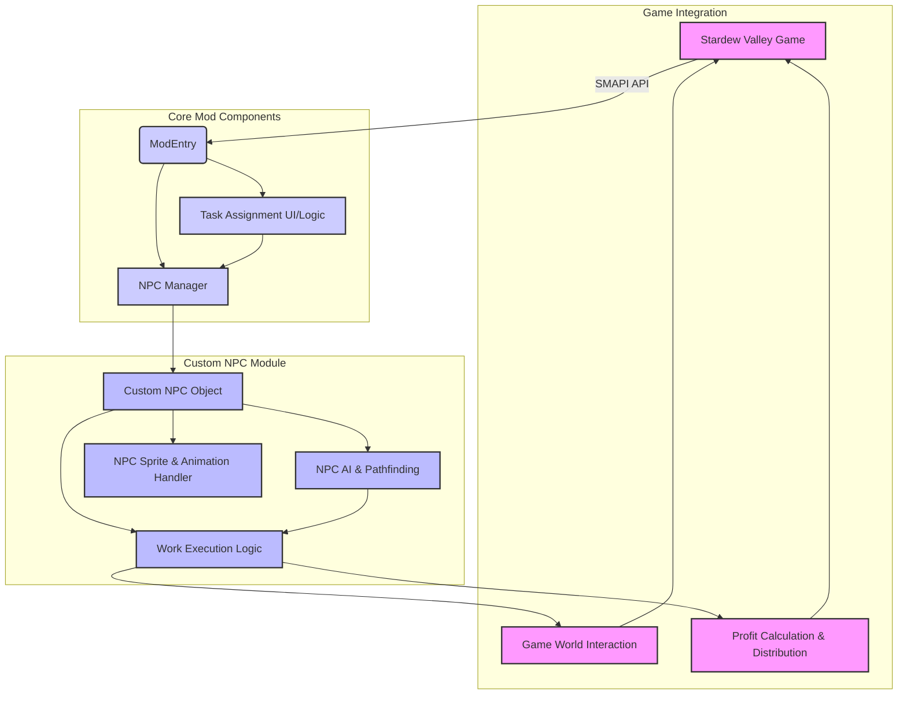

# 기술 스택 및 아키텍처 분석

## 1. SMAPI 모딩 기술 스택

스타듀밸리 SMAPI 모드 개발을 위한 핵심 기술 스택은 다음과 같습니다.

### 1.1. 프로그래밍 언어: C#
SMAPI 모드는 C# 언어를 사용하여 개발됩니다. C#은 Microsoft에서 개발한 객체 지향 프로그래밍 언어로, .NET 프레임워크 위에서 실행됩니다. 스타듀밸리 게임 자체도 C#으로 개발되었기 때문에, C#을 사용하여 모드를 개발하는 것은 게임의 내부 로직과 상호작용하는 데 매우 효율적입니다. C#의 기본 문법, 객체 지향 개념(클래스, 상속, 인터페이스 등), 이벤트 기반 프로그래밍 패러다임에 대한 이해가 필수적입니다 [1].

### 1.2. 개발 환경: .NET 6 SDK 및 IDE
SMAPI 모드는 .NET 6 SDK를 대상으로 빌드됩니다. 이는 스타듀밸리 게임이 현재 .NET 6 환경에서 실행되기 때문입니다. 개발을 위해서는 Visual Studio Community (Windows), JetBrains Rider (Windows, Linux, macOS), 또는 Visual Studio Code (Linux, macOS)와 같은 통합 개발 환경(IDE)이 필요합니다. 이들 IDE는 C# 코드 작성, 디버깅, 빌드 및 배포를 위한 기능을 제공합니다 [1].

### 1.3. 모딩 API: SMAPI (Stardew Modding API)
SMAPI는 스타듀밸리 모드 개발을 위한 공식적인 API입니다. SMAPI는 모드가 게임의 내부 로직에 안전하고 효율적으로 접근하고 상호작용할 수 있도록 다양한 기능을 제공합니다. 주요 기능은 다음과 같습니다 [1]:

*   **모드 로딩 및 관리**: 모드를 게임에 로드하고, 충돌을 방지하며, 오류 발생 시 게임을 복구하는 기능을 담당합니다.
*   **이벤트 시스템**: 게임 내에서 발생하는 다양한 이벤트(예: 플레이어 행동, 시간 경과, 아이템 사용 등)에 반응할 수 있는 메커니즘을 제공합니다. 이는 모드가 특정 조건에서 동작을 트리거하는 데 필수적입니다.
*   **게임 데이터 접근**: 게임의 자산(Asset) 및 데이터(Data)에 접근하고 수정할 수 있는 간소화된 API를 제공합니다. 이를 통해 아이템 정보, NPC 정보, 맵 데이터 등을 동적으로 변경할 수 있습니다.
*   **유틸리티**: 플레이어 설정, 번역, 리플렉션 등 모드 개발에 필요한 다양한 유틸리티 기능을 제공합니다.
*   **크로스 플랫폼 호환성**: 개발자가 별도로 신경 쓰지 않아도 모드가 Windows, Linux, macOS 등 다양한 운영체제에서 작동하도록 지원합니다.

### 1.4. 빌드 도구: Pathoschild.Stardew.ModBuildConfig NuGet 패키지
이 NuGet 패키지는 SMAPI 모드 프로젝트의 빌드 프로세스를 간소화합니다. 특히, 모드를 컴파일하고 게임의 `Mods` 디렉토리에 자동으로 배치하는 기능을 제공하여 개발 및 테스트 과정을 효율적으로 만듭니다 [1].

### 1.5. 게임 엔진: MonoGame
스타듀밸리는 MonoGame 프레임워크를 기반으로 개발되었습니다. MonoGame은 C#으로 게임을 개발할 수 있게 해주는 오픈 소스 게임 개발 프레임워크입니다. SMAPI 모드 개발 시 MonoGame의 그래픽, 입력, 오디오 처리 방식에 대한 직접적인 지식이 필수는 아니지만, 게임의 내부 동작을 이해하는 데 도움이 될 수 있습니다.

### 1.6. 데이터 직렬화: Newtonsoft.Json
SMAPI는 종종 JSON 형식의 데이터를 처리하기 위해 Newtonsoft.Json 라이브러리를 사용합니다. 이는 모드 설정, 게임 데이터 저장 및 로드, 그리고 Content Patcher와 같은 다른 모드와의 상호작용에 활용됩니다. JSON 데이터 구조와 직렬화/역직렬화 개념에 대한 이해가 필요합니다 [1].

## 2. Automate 모드 구조 분석 (예상)

Automate 모드는 게임 내 자동화 작업을 수행하는 데 중점을 둔 모드입니다. 이 모드의 핵심 구조는 다음과 같이 예상할 수 있습니다.

### 2.1. 핵심 로직: 이벤트 기반 처리
Automate 모드는 SMAPI의 이벤트 시스템을 적극적으로 활용할 것입니다. 예를 들어, `GameLoop.UpdateTicked` 이벤트나 `World.ObjectPlaced` 이벤트 등을 구독하여 게임 상태 변화를 감지하고, 이에 따라 자동화 로직을 실행할 것입니다. 이는 게임의 매 틱마다 또는 특정 객체가 배치될 때마다 연결된 기계와 상자의 상태를 확인하고 필요한 작업을 수행하는 데 사용됩니다.

### 2.2. 상자-기계 연결 관리
모드는 상자와 기계 간의 물리적 근접성을 감지하고, 이들 간의 논리적 연결을 관리하는 내부 데이터 구조를 가질 것입니다. 플레이어가 상자를 기계 옆에 배치하면, 모드는 이 연결을 인식하고 해당 기계의 입출력 작업을 상자를 통해 처리하도록 설정할 것입니다.

### 2.3. 아이템 흐름 제어
가장 중요한 부분은 아이템의 흐름을 제어하는 로직입니다. 이는 다음과 같은 단계를 포함할 수 있습니다:

1.  **원재료 추출**: 기계가 작동하는 데 필요한 원재료를 연결된 상자에서 찾아 추출합니다.
2.  **가공 및 처리**: 기계가 원재료를 사용하여 제품을 생산하도록 트리거합니다.
3.  **제품 저장**: 생산된 제품을 다시 연결된 상자에 저장합니다.

이 과정에서 어떤 아이템이 어떤 기계에 필요한지, 어떤 아이템이 생산되는지 등을 정의하는 데이터 매핑이 중요하게 사용될 것입니다.

### 2.4. 설정 및 구성
Automate 모드는 `config.json` 파일 등을 통해 사용자가 자동화 규칙이나 동작 방식을 설정할 수 있도록 할 것입니다. 예를 들어, 특정 기계의 자동화 여부, 처리 속도 조절 등의 옵션을 제공할 수 있습니다.

### 2.5. 성능 최적화
자동화 로직이 게임 성능에 영향을 미치지 않도록 효율적인 경로 탐색, 스케줄링, 그리고 불필요한 연산 최소화 등의 최적화 기법이 적용될 것입니다. 예를 들어, 모든 상자와 기계를 매 틱마다 검사하는 대신, 필요한 경우에만 업데이트를 수행하거나, 변경된 부분만 처리하는 방식을 사용할 수 있습니다.

## 3. NPC 생성 및 제어 기술 스택 분석

플레이어가 컨트롤할 수 있는 신규 NPC를 생성하고 제어하는 것은 스타듀밸리 모딩에서 복잡한 부분 중 하나입니다. `jdm/stardew-npc-creator`와 같은 도구는 NPC 에셋 생성에 도움을 주지만, 실제 게임 내 동작은 C# 코드로 구현해야 합니다.

### 3.1. NPC 데이터 구조 및 로딩
스타듀밸리 내의 NPC는 특정 데이터 구조를 가집니다. 이는 이름, 외형(스프라이트 시트), 스케줄, 대화, 관계, 그리고 다양한 속성들을 포함합니다. 신규 NPC를 생성하려면 이러한 데이터 구조를 이해하고, SMAPI를 통해 게임에 새로운 NPC 데이터를 주입해야 합니다. 이는 게임의 `Data/Characters` 또는 유사한 에셋을 수정하는 방식으로 이루어질 수 있습니다.

### 3.2. 스프라이트 및 애니메이션
NPC의 외형은 스프라이트 시트(Sprite Sheet)로 정의됩니다. 각 스프라이트 시트는 NPC의 다양한 동작(걷기, 도구 사용 등)과 방향(상, 하, 좌, 우)에 따른 프레임을 포함합니다. 신규 NPC를 추가하려면 해당 스프라이트 시트를 생성하고, 게임이 이를 로드하여 올바르게 렌더링하도록 해야 합니다. 애니메이션은 게임 엔진이 스프라이트 시트의 특정 프레임을 순서대로 표시하여 움직임을 만들어내는 방식입니다. SMAPI는 이러한 스프라이트 및 애니메이션 로딩을 위한 API를 제공할 수 있습니다.

### 3.3. AI 및 경로 탐색 (Pathfinding)
NPC가 게임 내에서 자율적으로 움직이고 작업을 수행하려면 정교한 AI 및 경로 탐색 로직이 필요합니다. 이는 다음과 같은 요소를 포함합니다:

*   **목표 설정**: NPC가 수행할 작업(예: 농작물 수확, 광석 채굴)에 따라 목표 지점을 설정합니다.
*   **경로 계산**: 현재 위치에서 목표 지점까지의 최적 경로를 계산합니다. 스타듀밸리 맵은 타일 기반이므로, A* 알고리즘과 같은 타일 기반 경로 탐색 알고리즘이 사용될 수 있습니다.
*   **장애물 회피**: 건물, 나무, 바위 등 게임 내 장애물을 피하여 이동하도록 합니다.
*   **스케줄링**: NPC의 하루 일과를 정의하고, 특정 시간에 특정 작업을 수행하도록 스케줄을 관리합니다. 이는 게임 시간과 동기화되어야 합니다.

### 3.4. 작업 할당 및 실행 로직
플레이어가 NPC에게 작업을 할당할 수 있는 UI 또는 명령 시스템이 필요합니다. 이 시스템은 할당된 작업을 NPC의 AI 로직에 전달하고, NPC가 해당 작업을 수행하도록 트리거합니다. 각 작업(농사, 채집, 채굴 등)에 대한 구체적인 게임 내 상호작용 로직을 C#으로 구현해야 합니다. 예를 들어:

*   **농사**: 씨앗 심기, 물주기, 수확 애니메이션 및 관련 게임 로직 호출.
*   **채집**: 채집 가능한 아이템을 찾아 이동하고, 채집 애니메이션 및 아이템 획득 로직 호출.
*   **광석 채굴**: 광석을 찾아 이동하고, 곡괭이 사용 애니메이션 및 광석 획득 로직 호출.

### 3.5. 수익 정산
NPC가 작업을 완료하면, 해당 작업에서 발생한 수익을 플레이어에게 정산하는 로직이 필요합니다. 이는 게임 내 화폐 시스템과 연동되어야 하며, 수익 계산 및 플레이어 인벤토리/자금 업데이트를 포함합니다.

### 3.6. 성능 및 밸런스 고려
여러 NPC가 동시에 작업을 수행할 경우 게임 성능 저하가 발생할 수 있습니다. 따라서 AI 로직은 효율적으로 설계되어야 하며, 불필요한 연산을 최소화해야 합니다. 또한, NPC의 자동화 작업이 게임 밸런스를 해치지 않도록 수익률, 작업 속도 등을 신중하게 조정해야 합니다.

## 4. 자동화 NPC 모드의 전체 아키텍처 스케치 (개념적)

제안하는 자동화 NPC 모드의 개념적 아키텍처는 다음과 같은 주요 구성 요소로 이루어질 수 있습니다.

### 4.1. ModEntry
SMAPI 모드의 진입점입니다. SMAPI 이벤트를 구독하고, `NPC Manager` 및 `Task Assignment UI/Logic`과 같은 핵심 모듈을 초기화합니다.

### 4.2. NPC Manager
신규 NPC 객체를 생성, 관리, 로드 및 언로드하는 역할을 담당합니다. 게임의 NPC 컬렉션에 커스텀 NPC를 추가하고 제거하는 로직을 포함합니다. 또한, 모든 활성 NPC의 상태를 추적하고 업데이트를 조정합니다.

### 4.3. Task Assignment UI/Logic
플레이어가 NPC에게 작업을 할당할 수 있는 사용자 인터페이스(UI) 또는 명령 처리 로직을 구현합니다. 이는 게임 내 메뉴, 채팅 명령 또는 특정 아이템 사용을 통해 이루어질 수 있습니다. 할당된 작업은 `NPC Manager`를 통해 해당 `Custom NPC Object`로 전달됩니다.

### 4.4. Custom NPC Object
게임 내의 기존 `NPC` 클래스를 상속하거나 확장하여 새로운 NPC의 속성과 동작을 정의하는 클래스입니다. 이 객체는 `NPC AI & Pathfinding`, `NPC Sprite & Animation Handler`, `Work Execution Logic`과 같은 하위 모듈을 포함합니다.

### 4.5. NPC AI & Pathfinding
NPC의 지능적인 행동과 이동을 담당합니다. 할당된 작업을 기반으로 목표 지점을 설정하고, 게임 맵 내에서 효율적인 경로를 계산하며, 장애물을 회피하는 로직을 포함합니다. 스케줄 관리 및 우선순위 결정도 이 모듈에서 처리됩니다.

### 4.6. NPC Sprite & Animation Handler
신규 NPC의 스프라이트 시트를 로드하고, NPC의 현재 상태(걷기, 작업 중 등)에 따라 적절한 애니메이션을 재생하는 역할을 합니다. `jdm/stardew-npc-creator`와 같은 도구로 생성된 에셋을 활용할 수 있습니다.

### 4.7. Work Execution Logic
NPC에게 할당된 실제 작업을 게임 내에서 수행하는 로직입니다. 농사, 채집, 광석 채굴 등 각 작업 유형에 대한 구체적인 상호작용(예: 도구 사용, 아이템 획득)을 구현합니다. 이는 `Game World Interaction` 모듈을 통해 게임 세계와 상호작용합니다.

### 4.8. Game World Interaction
게임 세계의 객체(작물, 광석, 도구 등)와 상호작용하는 추상화 계층입니다. `Work Execution Logic`이 게임의 특정 API를 직접 호출하는 대신, 이 모듈을 통해 안전하게 상호작용하도록 합니다.

### 4.9. Profit Calculation & Distribution
NPC가 작업을 완료했을 때 발생하는 수익을 계산하고, 이를 플레이어의 인벤토리나 자금으로 정산하는 로직입니다. 게임의 경제 시스템과 연동됩니다.

## 5. 주요 클래스 및 로직 구조 개요

### 5.1. `ModEntry.cs`
*   `Entry(IModHelper helper)`: 모드 초기화, 이벤트 구독 (`GameLoop.UpdateTicked`, `Input.ButtonPressed` 등).
*   `Monitor`: 디버깅 및 로깅을 위한 SMAPI 로거 인스턴스.
*   `Helper`: SMAPI가 제공하는 유틸리티 및 API 접근을 위한 인터페이스.

### 5.2. `NPCManager.cs`
*   `AddNPC(CustomNPC npc)`: 새로운 커스텀 NPC를 게임에 추가.
*   `RemoveNPC(string npcName)`: 특정 NPC를 게임에서 제거.
*   `GetNPC(string npcName)`: 이름으로 NPC 객체 조회.
*   `UpdateNPCs()`: 모든 활성 NPC의 상태를 업데이트하고, AI 및 작업 실행 로직을 트리거.

### 5.3. `CustomNPC.cs`
*   `public class CustomNPC : NPC`: 기존 `NPC` 클래스를 상속.
*   `CurrentTask`: 현재 수행 중인 작업 (`Task` 객체).
*   `Schedule`: NPC의 일일 스케줄을 정의하는 데이터 구조.
*   `MoveTo(Vector2 targetTile)`: 특정 타일로 이동 명령.
*   `PerformAction(Task task)`: 할당된 작업을 수행.
*   `Update(GameTime time)`: 매 틱마다 호출되어 NPC의 AI 및 애니메이션을 업데이트.

### 5.4. `Task.cs`
*   `public enum TaskType { Farming, Foraging, Mining, ... }`: 작업 유형 정의.
*   `TargetLocation`: 작업 대상 위치 (타일 좌표).
*   `AssignedPlayer`: 작업을 할당한 플레이어 (수익 정산을 위함).
*   `IsCompleted`: 작업 완료 여부.

### 5.5. `Pathfinder.cs`
*   `FindPath(Vector2 start, Vector2 end)`: A* 알고리즘 등을 사용하여 경로를 계산하고 타일 목록 반환.
*   `CanMoveTo(Vector2 tile)`: 특정 타일로 이동 가능한지 여부 확인 (충돌 감지).

### 5.6. `WorkLogic.cs` (또는 `FarmingLogic.cs`, `MiningLogic.cs` 등)
*   `PerformFarming(CustomNPC npc, Vector2 targetTile)`: 농사 작업 로직 구현 (씨앗 심기, 물주기, 수확).
*   `PerformMining(CustomNPC npc, Vector2 targetTile)`: 광석 채굴 로직 구현 (곡괭이 사용, 광석 획득).
*   `PerformForaging(CustomNPC npc, Vector2 targetTile)`: 채집 작업 로직 구현 (아이템 획득).

### 5.7. `SpriteAnimator.cs`
*   `LoadSpriteSheet(string path)`: 스프라이트 시트 이미지 로드.
*   `UpdateAnimation(CustomNPC npc, GameTime time)`: NPC의 상태에 따라 적절한 애니메이션 프레임 업데이트.

이러한 구조를 통해 모듈화된 방식으로 자동화 NPC 모드를 개발할 수 있으며, 각 기능별로 명확한 역할을 분담하여 확장성과 유지보수성을 높일 수 있습니다.

---

## 참고 문헌

[1] Stardew Valley Wiki. (2025, May 12). Modding:Modder Guide/Get Started. Retrieved from [https://stardewvalleywiki.com/Modding:Modder_Guide/Get_Started](https://stardewvalleywiki.com/Modding:Modder_Guide/Get_Started)
[2] Pathoschild. (n.d.). Pathoschild/StardewMods. GitHub. Retrieved from [https://github.com/Pathoschild/StardewMods](https://github.com/Pathoschild/StardewMods)
[3] jdm. (n.d.). jdm/stardew-npc-creator. GitHub. Retrieved from [https://github.com/jdm/stardew-npc-creator](https://github.com/jdm/stardew-npc-creator)

